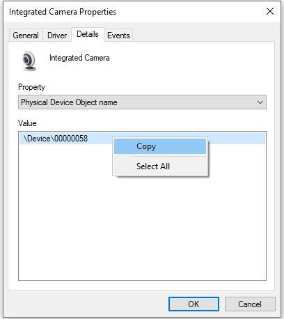
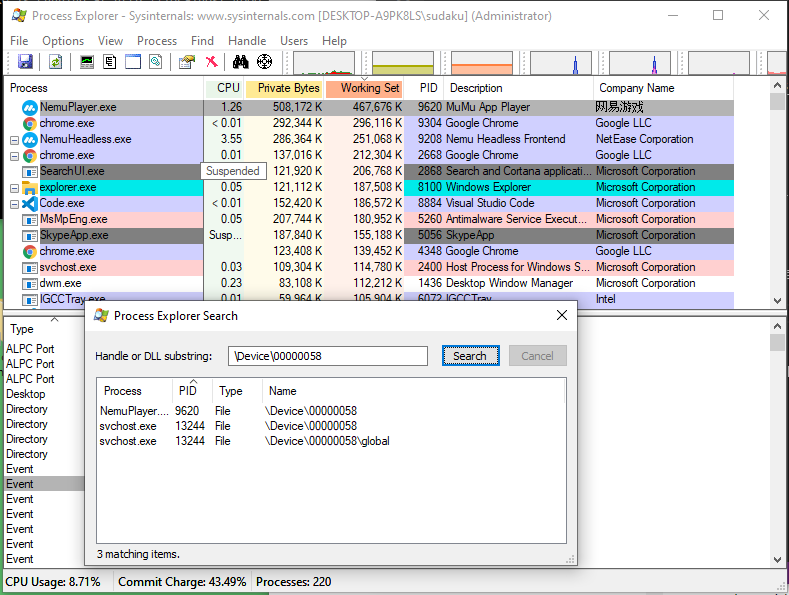

# Windows OS

## Windows 11 Configurations

- **Install Microsoft Store**
  ```powershell
  wsreset -i
  ```
- **Use UTC**
  ```powershell
  reg add "HKLM\SYSTEM\CurrentControlSet\Control\TimeZoneInformation" /v RealTimeIsUniversal /t REG_DWORD /d 1 /f
  ```
- **Disable Fast Boot (Which benefit is not very sensible on SSD)**
  ```powershell
  reg add "HKLM\SYSTEM\CurrentControlSet\Control\Session Manager\Power" /v HiberbootEnabled /t REG_DWORD /d 0 /
  ```
- **Disable WFP logging for Port Scanning Prevention Filter, which generate senseless writes for SSD**
  ```powershell
  netsh wfp set options netevents=off
  ```
- **Disable Telemetry**. In Group policy:
  ```plaintext
  Administrative Templates
   -> Windows Components
    -> Data Collection and Preview Builds
     -> Allow Telemetry -> Enabled, Options: 0 - Security [Enterprise Only]
  ```
  ```plaintext
  Task Scheduler Library
   -> Microsoft
    -> Windows
     -> Application Experience
      -> Microsoft Compatibility Appraiser -> Disable
  ```
  Disable Connected User Experiences and Telemetry Service
  ```powershell
  Set-Service DiagTrack -StartupType Disabled
  ```
- Disable CPU Spectre, Meltdown, ZombieLoad Patch
  ```batch
  reg add "HKEY_LOCAL_MACHINE\SYSTEM\CurrentControlSet\Control\Session Manager\Memory Management" /v FeatureSettingsOverride /t REG_DWORD /d 3 /f
  reg add "HKEY_LOCAL_MACHINE\SYSTEM\CurrentControlSet\Control\Session Manager\Memory Management" /v FeatureSettingsOverrideMask /t REG_DWORD /d 3 /f
  ```
  [Microsoft Docs](https://support.microsoft.com/en-us/help/4073119/protect-against-speculative-execution-side-channel-vulnerabilities-in)
- Show seconds in taskbar
  ```batch
  reg add "HKEY_CURRENT_USER\Software\Microsoft\Windows\CurrentVersion\Explorer\Advanced" /v ShowSecondsInSystemClock /t REG_DWORD /d 1 /f
  ```
- Windows 11 full right-click menu
  - Enable: `reg add "HKCU\Software\Classes\CLSID\{86ca1aa0-34aa-4e8b-a509-50c905bae2a2}\InprocServer32" /f /ve`
  - Disable: `reg delete "HKCU\Software\Classes\CLSID\{86ca1aa0-34aa-4e8b-a509-50c905bae2a2}" /f`

   > Don't forget to reboot.

## System Administration and Troubleshooting Guide

### Checking Processes Using the Webcam

To identify which processes are accessing your webcam, use **Process Explorer** from Microsoft Sysinternals.

#### Steps

1. **Download Process Explorer**
  - Obtain [Process Explorer](https://docs.microsoft.com/en-us/sysinternals/downloads/process-explorer)
  - Extract the files and run `procexp64.exe` **with administrator privileges**.
2. **Locate the Webcam's Physical Device Object Name**
  - Open **Device Manager** (`devngnt,nsc`).
  - Find your webcam under "Imaging devices" or "Cameras".
  - Right-click the webcam, select **Properties** > **Details** tab, and choose **Physical Device Object name** from the
  dropdown.
  - Copy the displayed value (e.g., `\Device\000000XX`).
    
3. **Search for Processes in Process Explorer**
  - Open **Process Explorer** with administrator rights.
  - Press `<C-f>`, and paste the webcam's physical device object name, to search in handles.
  - Review the results to identify processes using the webcam (e.g., an emulator like MuMu with its camera app open).
    

> Notes:
> - If only `svchost.exe` appears in the results, a **Universal Windows Platform (UWP)** app is likely using the webcam.
> - This method can also be used to check other devices, such as microphones, by finding their physical device object
>   names.

### Enabling Compact Compression for System Files

Compact compression reduces the disk space used by Windows system files.

Run these in an **elevated** PowerShell or Command Prompt:
- **Enable Compression:**
  ```powershell
  compact /compactos:always
  ```
  Compresses all system files to save disk space.
- **Check Compression Status:**
  ```powershell
  compact /compactos:query
  ```
  Displays whether compact compression is enabled.
- **Disable Compression:**
  ```powershell
  compact /compactos:never
  ```

> Compression may slightly impact performance but significantly reduces disk usage.

### Cleaning the Component Store (WinSxS)

The WinSxS folder stores Windows component files and can grow large over time. Use the Deployment Image Servicing and
Management (DISM) tool to analyze and clean it.

Run these in an **elevated** PowerShell or Command Prompt:
- **Analyze Component Store Size:**
  ```powershell
  dism.exe /Online /Cleanup-Image /AnalyzeComponentStore
  ```
  Reports the size of the WinSxS and recommends cleanup if necessary.
- **Clean Component Store:**
  ```powershell
  dism.exe /online /Cleanup-Image /StartComponentCleanup
  ```
  Removes superseded and unused components from WinSxS

> Cleaning WinSxS is safe but irreversible; ensure you don’t need older component versions before proceeding.

### Managing Intel Management Engine (ME) Firmware

The Intel Management Engine (ME) is a subsystem in Intel chipsets. Use Intel's tools to view, back up, or update ME
firmware.

#### Tools Required

- `MEInfoWin.exe`: Displays ME firmware information.
- `FWUpdLcl64.exe`: Backs up or updates ME firmware.

> Download these from Intel’s official website or your motherboard manufacturer.

#### Steps

1. **View ME Information:**
   ```powershell
   MEInfoWin.exe
   ```
2. **Back Up ME Firmware:**
   ```powershell
   FWUpdLcl64.exe -SAVE backup.bin
   ```
3. **Update ME Firmware:**
   ```powershell
   FWUpdLcl64.exe -f ..\ME8_1.5M_Production.bin
   ```

### Troubleshooting Hyper-V Manager

Hyper-V Manager may require remote management configuration using Windows Remote Management (WinRM). Follow these steps
to enable and configure WinRM on both the client and host machines.

### Steps

1. **Enable WinRM on Client and Host**
  ```powershell
  Enable-PSRemoting -Force
  ```
  This configures WinRM to receive requests and starts the service.
  - If you encounter a firewall error (e.g., network set Public), set the network connection to **Private**:
    ```powershell
    Get-NetConnectionProfile
    ```
    Note the `InterfaceIndex` of each network (e.g., `9` or `16`). 
    ```powershell
    Set-NetConnectionProfile -InterfaceIndex <Index> -NetworkCategory Private
    ```
    > If error persist, by pass the network profile check:
    > ```powershell
    > Enable-PSRemoting -SkipNetworkProfileCheck -Force
    > ```
2. **Configure Trusted Hosts on the Client**
  - Add the host machine to the client’s trusted hosts list:
    ```powershell
    Set-Item WSMan:\localhost\Client\TrustedHosts -value "DESKTOP-XXXXXXX.lan" -Force
    ```
  - Verify the trusted hosts:
    ```powershell
    Get-Item WSMan:\localhost\Client\TrustedHosts
    ```
  - To add multiple hosts, append to the existing list:
    ```powershell
    $cur_val = (Get-Item WSMan:\localhost\Client\TrustedHosts).value
    Set-Item WSMan:\localhost\Client\TrustedHosts -Value "$cur_val,server01.tailba6c3f.ts.net"
    ```

> Notes:
> - Use `-Force` to avoid prompts, but verify settings afterward.
> - Trusted hosts can include wildcards (e.g., `*.domain.com`) for broader access.


## References

1. [Windows Installation Guide](https://mirrors.sdu.edu.cn/docs/guide/Windows-iso/)
